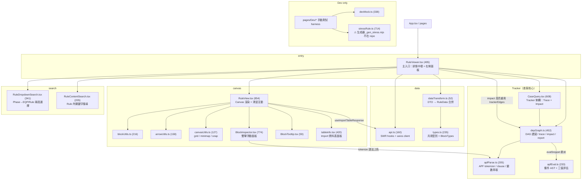

[TOC]

## Dependency Graph

## File Index

| 檔案 | 行數 | 職責 | 備註 |
|------|------|------|------|
| `RuleViewer.tsx` | 658 | 主入口；持有全部跨元件狀態；**selection（selectedFab/Phase）與 loaded（loadedFab/Phase/Rule）分離**：dropdown 只改 selection，按「載入」才提交成 loaded；**URL deep link 還原+同步**；canvas 與側欄完全受控同步 | rule 資料只依 loaded 三元組抓 → dropdown 操作不清畫面；按載入時 tuple 相同則 no-op（不重抓/重排）。loaded 三元組入 URL（+log/mode/var）；runtime/expanded 不入 |
| `types.ts` | 256 | DTO / RuleData / Block / Arrow / DepGraph / ViewNode / **TrackerMode / ImpactResult / ImpactPath** 全型別 | `Repository: "Database"` 為 icon 對應，刻意不一致 |
| `api.ts` | 162 | axios client + `useAPI<T>` 信封拆解 + 6 個 SWR hooks（全部首參吃 `fab`，路徑 `/api/{fab}/RuleViewer/...`，fab 為 null 不打 API）| 後端 route `[Route("api/{fab}/[controller]")]`；fab 目前後端不驗證（隨便輸入）|
| `dataTransform.ts` | 52 | DTO 多列 → 以 baseName 合併為 RuleData（PREBLOCK split、去 `[n]` 後綴、取前 2）| |
| `apfParse.ts` | 205 | APF DSL：tokenize（上色共用）/ parseAPF（IF-THEN-ELSE clause）/ extractVars（跳字串註解 $log$ 函式名）| Tracker 解析正確性的根基 |
| `apfEval.ts` | 233 | APF 條件三值評估：lex（括號/AND/OR/NOT，跳字串註解、函式整段標 unknown）+ 遞迴下降 parseCond + evalCond（三值邏輯）| 自帶 lexer，不依賴 apfParse；evalSnippet 委派它 |
| `depGraph.ts` | 467 | 整條 rule 建一次 DAG（**buildDepGraph 跳過孤島** → Tracker 全演算法不含孤島）；**findIslandBlocks（孤島定義單一來源）**；traceLog / expandVar lazy 投影；computeTrace（canvas 邊）；**computeImpact（反向 BFS）**；evalSnippet（委派 apfEval）；buildLogReport；dumpDepGraph | `dumpDepGraph` 無 UI 掛載點 |
| `CaseQuery.tsx` | 608 | Tracker 側欄：**Trace/Impact 模式切換**；log 搜尋下拉、LayerNode 受控樹、Runtime Log + **trigger 命中 badge**、一鍵複製；**Impact 面板（變數 autocomplete → 受影響 log 清單 → 點擊跳 Trace）** | 「查案」主介面 |
| `RuleView.tsx` | 1101 | Canvas：blocks/arrows/grid/minimap 繪製、pan/zoom、hover/雙擊/右鍵、inspector 管理、tracker 邊上色（沿 PREBLOCK 結構 recolor，非直接拉線；dim 不到隱形）；**group 框選 + 整組拖曳 + 對齊/分佈 toolbar**；**孤島 block 警示** | 模組內最大檔；收 `fab` prop 供 import table fetch |
| `BlockInspector.tsx` | 774 | 浮動詳情面板：Shell（拖曳/縮放/z-index）+ 依類型 Body + 搜尋/Tracker 高亮 | |
| `tableinfo.tsx` | 420 | Import table 浮動面板：搜尋 / 排序 / 欄位拖曳與寬度 | |
| `RuleDropdownSearch.tsx` | 387 | **FAB（受控，props）**→ Phase → EQP/Rule 三段選擇；選 FAB 才開放下游 | FAB 清單寫死 `FAB_OPTIONS`，狀態提升至 RuleViewer |
| `RuleContentSearch.tsx` | 205 | Rule 內容關鍵字搜尋 → MatchResult[] | |
| `blockUtils.ts` | 230 | Block 建構 / icon 快取 / hit test / `blocksInRect`（marquee 相交）/ 繪製 | |
| `arrowUtils.ts` | 158 | PREBLOCK → Arrow 建構與繪製（主/副線）| MAIN 線改最深灰（非藍）|
| `alignUtils.ts` | 49 | 選取 block 對齊（6 op）/ 等距分佈（純函式，就地改 x/y）| spec 2026-06-14；可單測 |
| `canvasUtils.ts` | 127 | grid / minimap / snap / world bounds | |
| `BlockTooltip.tsx` | 59 | hover 提示 | |
| `devMock.ts` | 338 | 開發假資料 + VariableSource | |
| `stressRule.ts` | 714 | STRESS rule 快照（自動生成勿手改）| 生成器 `_gen_stress.mjs` 不在 repo |
| `index.ts` | 39 | barrel export | |

## Symbol Index（MPE：Module / Public symbols / Entry-consumers）

| Module | Public symbols | 被誰用 |
|--------|----------------|--------|
| `depGraph.ts` | `buildDepGraph` `findIslandBlocks` `resolveDefs` `traceLog` `expandVar` `computeTrace` `computeImpact` `evalSnippet` `collectLogClosure` `buildLogReport` `dumpDepGraph` `LogClosure` | RuleViewer（build/trace/impact）、CaseQuery、RuleView（findIslandBlocks 畫警示）、Dev |
| `apfParse.ts` | `tokenize` `HIGHLIGHT_RE` `parseAPF` `extractVars` `Token` `Clause` | depGraph、BlockInspector |
| `apfEval.ts` | `parseCond` `evalCond` `CondNode` `CmpOp` | depGraph（evalSnippet 委派）、apfEval.test |
| `api.ts` | `usePhaseResponse` `useEQPRuleResponse` `useRuleResponse` `useRuleInfoResponse` `useResourceDataResponse` `useImportTableResponse`（全部首參 `fab`）| RuleViewer、RuleView |
| `dataTransform.ts` | `convertDtosToData` | RuleViewer、Dev pages |
| `blockUtils.ts` | `buildBlocks` `getBlockImage` `hitTestBlock` `blocksInRect` `blockCenter` `drawBlock(s)` `BLOCK_SIZE` | RuleView、canvasUtils、arrowUtils |
| `alignUtils.ts` | `alignBlocks` `distributeBlocks` | RuleView（align toolbar）、groupOps.test |
| `arrowUtils.ts` | `buildArrows` `drawArrow(s)` `getSideCenter` `decideConnectionSides` | RuleView |
| `canvasUtils.ts` | `drawGrid` `drawMinimap` `snap` `getWorldBounds` `GRID_SIZE` | RuleView |
| `RuleViewer.tsx` | `default RuleViewer` | App routes |
| `RuleView.tsx` | `RuleView`（forwardRef `RuleViewHandle`: `focusBlockById` / `openInspectorById`）| RuleViewer、DevRuleView |
| `CaseQuery.tsx` | `CaseQuery` `CaseQueryProps` | RuleViewer、DevCaseQuery |
| `types.ts` | 全型別 + `BlockTypes` `Sides` | 模組內全部 |

## 資料流（查案視角）

1. **載入**：`RuleDropdownSearch` 選 FAB → Phase（= selection，驅動 phase/eqp 清單）→ 按「載入」提交成 **loaded** → `useRuleInfoResponse(loadedFab, loadedPhase, loadedRule)` → `convertDtosToData` → `RuleData[]`（dropdown 改 selection 不重抓；未選 FAB 時清單 hook 不打 API）
2. **建圖**：`buildDepGraph(rules)`（`useMemo`，整條 rule 一次）→ vars / logs / roots / ancestors（PREBLOCK 反向 BFS）
3. **追蹤**：輸入 `[$LOG$]` → `traceLog` 第一層 → 點節點 / 右鍵 canvas block → `expandedBlocks`（block-keyed，canvas 與側欄共用）→ `computeTrace` 算 canvas 邊
4. **Runtime**：貼 `(VAR: value)` log → `parseRuntimeLog` → `evalSnippet` 逐邊判 fired → 自動展開命中路徑
5. **輸出**：`buildLogReport` → clipboard → 貼給 AI 分析

## 已知風險 / Gap

| 項 | 說明 |
|----|------|
| 測試僅含純函式 | vitest 已建（`npm test`）；apfEval(12) + computeImpact(6) 已測；UI 互動（impact 面板 / canvas 高亮 / URL 還原 / trigger badge）仍靠 F5 目視 |
| `_gen_stress.mjs` 失蹤 | stressRule.ts 標頭指向的生成器不存在 → 與後端 RTDMockData.cs 漂移無從重生 |
| ~~api.ts 註解 drift~~ | ✅ 已修：改為據實「一律打後端、無 mock fallback」 |
| mock 改 dev-only | `devMock.ts`/`stressRule.ts` + 7 個 `/dev/*` 頁以 `import.meta.env.DEV` gate（App.tsx 路由、HomeLayout 選單）；barrel 不再 re-export mock → production bundle 零 mock（build 已驗證） |
| evalCond 函式呼叫保守 | `COUNT(...)` 等函式子條件一律 unknown（不模擬值）；AND/OR/NOT/括號複合條件已支援三值邏輯 |
| 跨 rule impact 未做 | computeImpact 限當前載入 rule；跨 rule 影響需後端 endpoint（backlog）|
| 孤島偵測 | `depGraph.findIslandBlocks`（單一來源）：無人以它為 PREBLOCK（DispatchScreen 豁免）。**Tracker 全演算法排除孤島**（buildDepGraph 跳過）；**Search（RuleContentSearch）仍可搜到**；canvas 紅虛線「⚠ 孤島」恆顯 + console.warn。mock 留 `FUNC_ISLAND_DEMO` 供驗證；純前端定義，後端不擋 |
| tracker 高亮畫法 | 不另疊線：`drawArrows(highlightColors)` 直接把追蹤鏈上的原箭頭換成 layer 色（fired: 綠/灰，否則 depth 色）；無關箭頭 dim 0.35 |
| ~~正向 impact 分析~~ | ✅ 已做（computeImpact + Impact 模式 UI，spec 2026-06-13）|
| ~~狀態不可分享~~ | ✅ 已做（URL deep link：phase/rule/log/mode/var，spec 2026-06-13）；runtime/expanded 仍不入 URL（刻意）|

## 查案資料流補充（spec 2026-06-13）

- **Impact（反向）**：Tracker 切 Impact 模式 → 輸入變數（`graph.vars` autocomplete）→ `computeImpact` 反向 BFS → 受影響 `[$LOG$]` 清單 + 最短 var 路徑 → 點 log 切回 Trace；canvas 重用 `trackerEdges` 高亮。
- **Deep link**：mount 讀 `?phase&rule` 觸發載入 → graph ready 補 `log/mode/var`（pending-ref 防 SWR race）→ 狀態變動 replace 寫回；失效 rule/log → notification + 清 param。
- **Clause 評估**：`evalSnippet` → `parseCond`+`evalCond`（apfEval），trigger 整體條件命中狀態顯示於 Tracker（成立/不成立/未知）。
